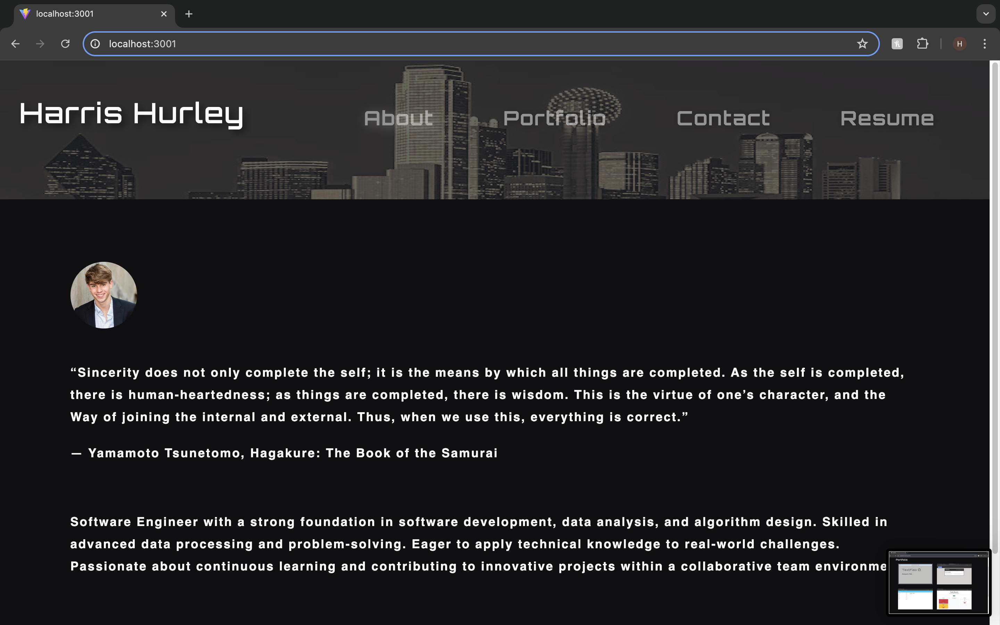
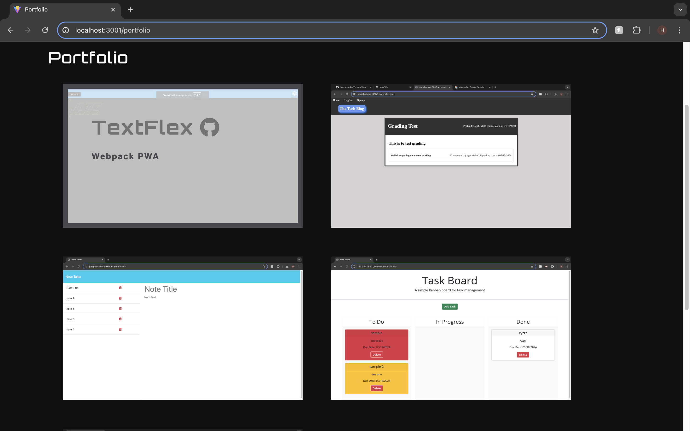
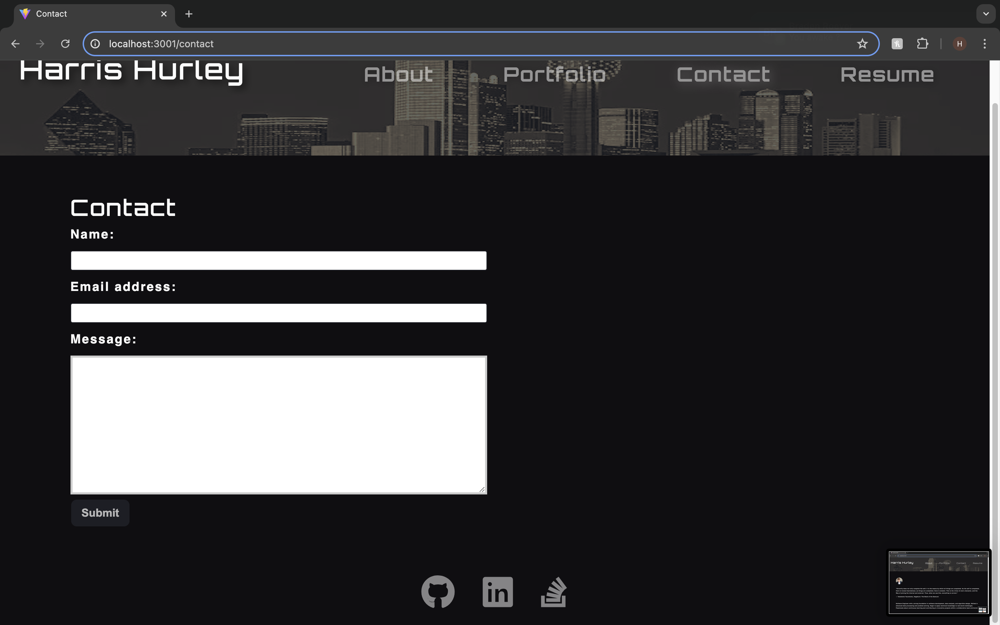
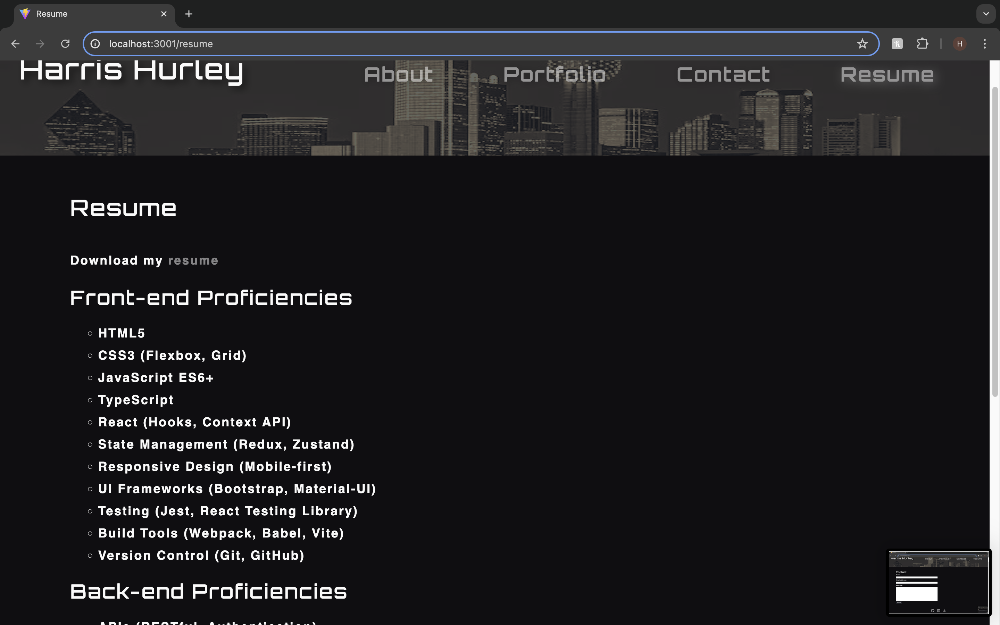

# Portfo React

    

## Description

This project is a professional portfolio website built using React. The portfolio showcases my projects, skills, and contact information, making it an essential tool for job applications, freelance work, and networking with other developers.

## Deployed Application URL

[PortfoReact](https://harrismhurley-portfolio.netlify.app/)

## Table of Contents
* [Installation](#installation)
* [Usage](#usage)
* [Credits](#credits)
* [Features](#features)
* [Dependencies](#dependencies)
* [Screenshots](#screenshots)
* [How to Contribute](#how-to-contribute)
* [Tests](#tests)
* [License](#license)

## Installation
To install this application, follow these steps:

1. Clone the repository to your local machine using the command: `git@github.com:harrismhurley/PortfoReact.git`
2. Navigate into the project directory
3. Install dependencies using npm: 'npm i'

## Usage
To use this application locally, follow these steps:

1. Install remaining dependencies with 'npm run build'
2. Start application with 'npm run start'
3. Open your web browser and navigate to `http://localhost:3001`

## Credits

N/A

## Features

- About Me: A section with a recent photo or avatar and a short bio.
- Portfolio: Titled images of six applications with links to deployed applications and GitHub repositories.
- Contact: A contact form with validation for required fields and email address.
- Resume: A downloadable resume and a list of proficiencies.
- Footer: Links to GitHub, LinkedIn, and another platform (e.g., Stack Overflow, Twitter).

## Dependencies

- react
- react-dom
- react-router-dom
- @types/react
- @types/react-dom
- @vitejs/plugin-react
- eslint
- eslint-plugin-react
- eslint-plugin-react-hooks
- eslint-plugin-react-refresh
- vite

## Screenshots

## How to Contribute
If you would like to contribute you can contact me [Via Email](mailto:harrismhurley@icloud.com?subject=[GitHub]%20Dev%20Connect) or visit [github](https://github.com/harrismhurley).

## Tests

N/A

## License 
This project is licensed under the [MIT](https://opensource.org/licenses/MIT) license.
